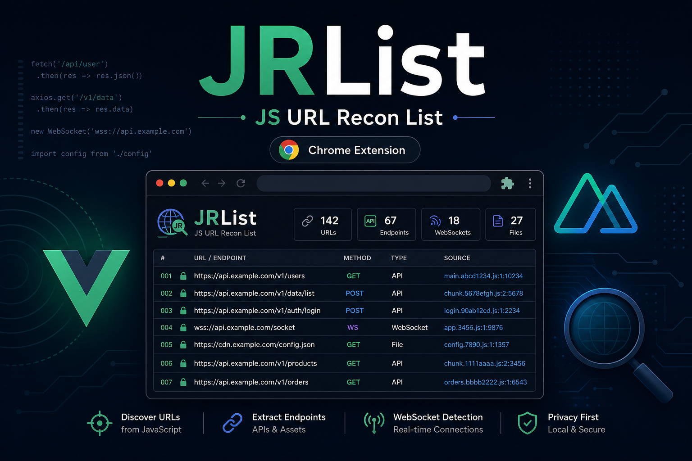

<p align="center">
  
</p>

# JRList

**J**S URL **R**econ **List** — Nuxt.js / Vue.js 페이지에서 URL·라우트·API 경로를 추출해 목록화하는 Chrome Extension (Manifest V3).

펜테스트·버그바운티·프론트엔드 리콘용 보조 도구입니다.

> **허가받은 대상에만 사용하세요.**

[English README](./README.md)

---

## 기능

- Nuxt / Vue 시그니처 감지 (`__NUXT__`, `__NUXT_DATA__`, Vue Router 등)
- DOM · 인라인 JS · `_nuxt` 번들 · Nuxt payload 에서 URL 수집
- `baseURL` / `apiBase` / Nuxt `app.baseURL` 기준 상대 경로 결합
- 카테고리: `base`, `api`, `nuxt`, `auth`, `admin`, `absolute`, `path`
- 필터 · 클립보드 복사 · TXT / JSON 내보내기
- 클릭 시에만 스크립트 주입 (상시 content script 없음)

---

## 설치

### 소스에서 설치 (개발 권장)

```bash
git clone https://github.com/KaiHT-Ladiant/JRList.git
cd JRList
```

1. Chrome → `chrome://extensions`
2. **개발자 모드** ON
3. **압축해제된 확장 프로그램을 로드합니다**
4. 저장소 루트(`manifest.json` 위치) 선택

### Release에서 설치 (CRX)

[Releases](https://github.com/KaiHT-Ladiant/JRList/releases)에서 `JRList.crx`를 받습니다.

> 최근 Chrome은 서명되지 않은 로컬 CRX 드래그 설치를 막을 수 있습니다. 실패하면 **압축해제 로드**를 사용하세요.

---

## 사용법

1. 대상 페이지를 연다
2. 툴바 **JRList** 아이콘 클릭
3. **스캔**
4. 필터 후 복사 / TXT / JSON 내보내기

| 옵션 | 설명 |
|------|------|
| JS 번들 스캔 | `script[src]` fetch 후 URL 추가 추출 (기본 ON) |

---

## CRX / ZIP 빌드

```bash
py -m pip install cryptography
py scripts/pack_crx.py
```

| 출력 | 설명 |
|------|------|
| `dist/JRList.crx` | CRX3 (로컬 서명) |
| `dist/JRList.zip` | 소스 ZIP |
| `keys/extension.pem` | 서명키 — **커밋/공유 금지** |

---

## 프로젝트 구조

```text
JRList/
├── manifest.json
├── background/service-worker.js
├── content/content.js
├── lib/url-parser.js
├── lib/page-bridge.js
├── popup/
├── icons/
├── assets/cover.png
├── scripts/pack_crx.py
├── scripts/generate_icons.py
├── README.md
├── README.ko.md
└── LICENSE
```

---

## 권한

| Permission | 용도 |
|------------|------|
| `activeTab` | 현재 탭 스캔 |
| `scripting` | 스크립트 주입 |
| `storage` | 세션 결과 저장 |
| `clipboardWrite` | 복사 |
| `host_permissions` (http/https) | 페이지·번들 접근 |

---

## 참고

- Cross-origin JS는 CORS로 읽지 못할 수 있습니다
- 난독화·런타임 조합 URL은 정적 파싱으로 놓칠 수 있습니다
- AV/EDR 오탐 가능 — 사내 예외 또는 스토어 서명 배포 권장

---

## 기여

Issue / PR 환영합니다.

### Contributors

- Community contributors via pull requests

---

## Disclaimer

허가된 보안 연구·테스트 목적입니다. 오남용으로 인한 결과에 대해 책임지지 않습니다.

## License

[MIT](./LICENSE)
